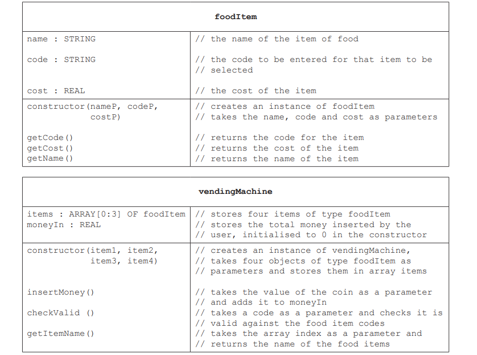
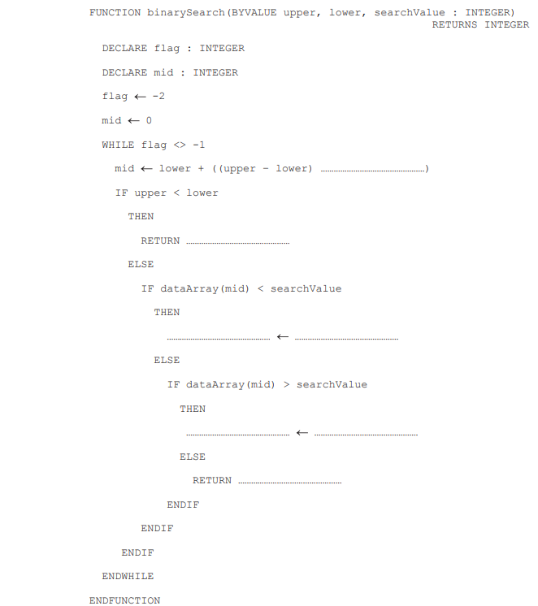

```markdown
Test: OOP and ADT
Full Marks: 24
Time: 50 min
```

1) The vending machine is part of a program that is written using object-oriented programming(OOP). The vending machine makes use of two classes that are described in the following tables.

> All attributes are declared as private.



(i) Write **program code** to declare the class vendingMachine. You are only required to write program code for attribute declarations and the constructor.[4]

If you are writing in Python, include attribute declarations using comments.

---

(ii) The method `checkValid()` takes the food item code as a parameter. It checks the code against each element in items and returns:
- `-1` if the code is not valid
- `-2` if the code is valid, but the `moneyIn` is less than the cost of the item
- the index of the item, if the code is valid and the `moneyIn` is greater than or equal to the cost of item.

Write program code for the method `checkValid()`. [5]

---

(iii) Four objects of type foodItem are declared with the identifiers:
`chocolate, sweets, sandwich, apple`. Write **program code** to declare an instance of vendingMachine with the identifier `machineOne` and the objects: `chocolate, sweets, sandwich, apple`. [2]

---
---

2) A binary search algorithm searches for data in sorted array.



(a) The pseudocode function `binarySearch()` performs a binary search to find a given value in the global array, dataArray. If the value is found, the function returns its index. If the value is not found, the function returns -1.

Write program for the function `binarySearch()` after completing the provided pseudocode. [6]


---

(b) Giles is writing a program using a stack.

The stack stores upto 1000 integers in the 1D array, `stackArray`.

(i) The procedure `setUpStack()` takes two parameters:
- the array, stackArray
- a pointer to the last element pushed onto the stack, `topOfStack`.

The procedure initializes all array elements to -1 and the pointer to -1.

Write **program code** for the procedure `setUpStack()`. [3]

---

(ii) The function `pop()` pops and returns the item from the top of the stack. If the stack is empty, it returns `-1`.

Write program for the function `pop()`. [4]

---
---