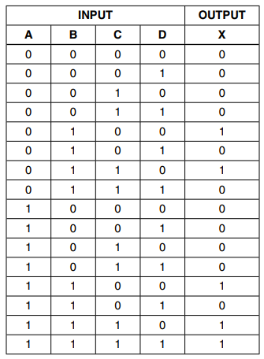
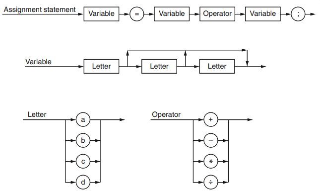

## Test - Paper 3 Theory

- Full marks: 40

<hr>

1) Temperature data from a number of weather stations are to be processed.
The following data are to be stored:
    - weather station ID(a unique four-letter code)
    - latitude (to 2 decimal places)
    - average temperature(to the nearest whole number) for each year from 2001 to 2015 inclusive

- A programmer designs a composite data type WeatherStation. A variable of this type can be used to store all the data for one particular station.
    - (i) Write the definition for the user-defined data type `WeatherStation`. [5]<br>
    - (ii) The programmer decides to store all the data in a file. The number of weather stations could grow to reach 200000, but not all stations will be present at first. The programmer decides on random file organization for the file. Describe `three` steps which show how a new weather station record is added to the file. [3]

<!-- - Declarattion:
```markdown
TYPE WeatherStation
    DECLARE StationID : STRING
    DECLARE Latitude : REAL
    DECLARE Temperature : ARRAY[1:15] OF INTEGER
ENDTYPE
```
- Steps:
    - Hash StationID to produce location
    - If free, insert
    - Else use overflow method -->

<hr>    

2) In a particular number system, real numbers are stored using floating pointt representation using:
    - 8 bits for mantissa <br>
    - 8 bits for exponent <br>
Two's complement form is used for both mantissa and exponent.

- (i) A real number is stored as the following two bytes:
    - Mantissa: 00101000 
    - Exponent: 00000011 <br>
Calculate the denary value of this number. Show working. [3]

- (ii) Explain why the floating point number is not normalized. [2]<br>
- (iii) Normalize the floating-point number. [2]<br>
- (iv) Write the largest positive number that can be written as a normalized number in this format. [2]<br>

<!-- - Answer:
    - 2.5
    - Positive number should start with 01...
    - 01010000 0000010
    - 01111111 0111111 -->

<hr>

3) In packet switching:

- (i) State `two items` that are contained in an email packet apart from the data. [2]
- (ii) Explain the role of routers in packet switching. [3]
<!-- 
- Answer:
    - Sender's IP, Receiver's IP, packet sequence number, checksum
    - data Split into packet, packet has IP, routers have routing table, routers use IP to route each packer, packets may not take same route -->

<hr>

4)  For the logic circuit with following truth table:


- (i) Construct K-map. [4] <br>
- (ii) Draw loops around appropriate groups of 1's to produce an optimal sum-of-products. [2] <br>
- (iii) Write the simplied sum-of-products Boolean function using the grouping in part (ii). [2] <br>
<!-- 
- Answer:
    - BD'+ABC
     -->

<hr>

5) The following syntax diagrams are for a particular programming language:


- (i) State with reason if the following statements are valid: [3]
    - a = b+c
    - a = b-2;
    - a = dd*cce;
- (ii) Write the Backus-Naur Form (BNF) for the syntax diagrams shown above. [6]
- (iii) Programmers working for the software company prefer to debug their programs using an interprete. Give `one` possible reason why. [1]

<!-- - Answer:
    - ';' missing
        - '2' is not a variable
        - 'e' is not a valid letter
    - `<assignment statement> ::= <variable> = <variable><operator><variable> ;`
        - `<variable> ::= <letter>|<letter><letter>|<letter><letter>`
        - `<letter> ::= a|b|c|d`
        - `<operator> ::= +|-|*|/|`
    - Can check line by line, dont need complete code. -->

<hr>